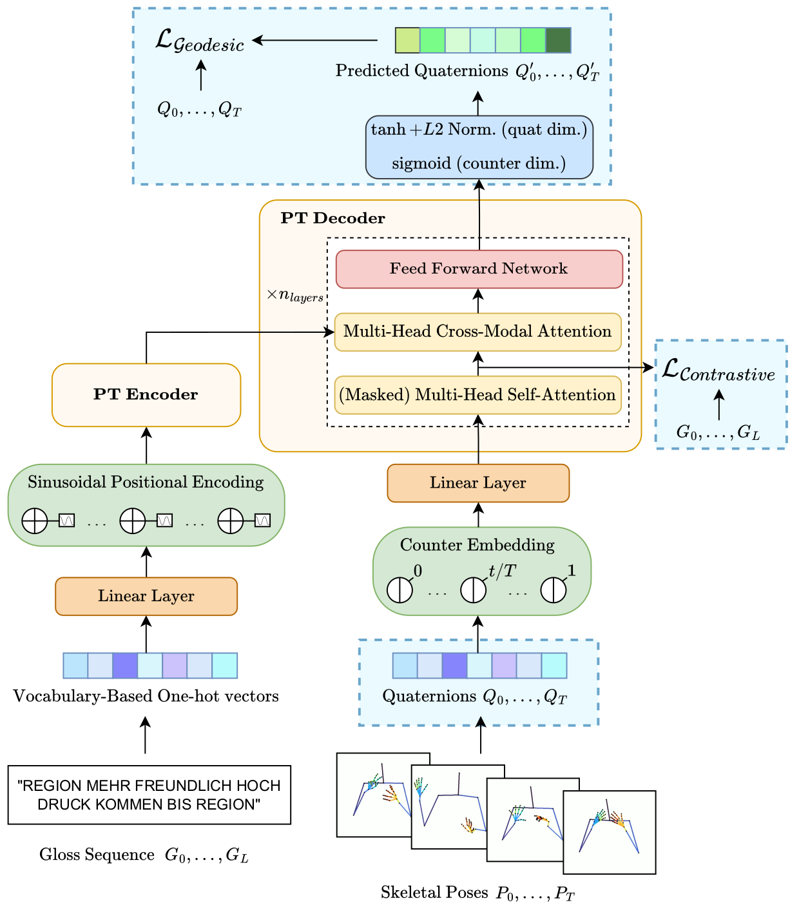

# ContQuat-PT

_Incorporation of **Cont**rastive learning and **Quat**ernion-based pose encoding 
in a **P**rogressive **T**ransformers-like model for sign language production._

Source code for the paper ["Towards Skeletal and Signer Noise Reduction in Sign Language Production via 
Quaternion-Based Pose Encoding and Contrastive Learning"](https://doi.org/10.48550/arXiv.2508.14574)
(Guilhem Fauré, Mostafa Sadeghi, Sam Bigeard, Slim Ouni - IVA 2025 SLTAT Workshop).

## 1. Description

*ContQuat-PT* uses the [Progressive Transformers](https://doi.org/10.48550/arXiv.2004.14874)
backbone architecture while allowing the following modifications and/or extensions:
- possibility to encode en predict skeletal poses via bone rotations using quaternion-based parametrization, and
replacing the MSE loss by a geodesic loss
- possibility to add a supervised contrastive loss (either based on gloss or SBERT similarity between sentences)
on the decoder's self-attention outputs, as a regularization term in the definition of the global loss

The following diagram provides an overview of the architecture and shows how our contributions integrate into it:

<p align="center">
  
</p>

## 2. Installation

```commandline
git clone https://github.com/GFaure9/ContQuat-PT.git
cd ./ContQuat-PT
pip install -r requirements.txt
```

## 3. Usage

#### Dataset

The model was originally trained and tested on the [RWTH-PHOENIX-Weather 2014 T dataset](https://www-i6.informatik.rwth-aachen.de/~koller/RWTH-PHOENIX-2014-T/)
(*Phoenix14T*) prepared as parallel `txt` files where each line represents a new sequence.
Hence, if you wish to train on *Phoenix14T* or another dataset, please prepare it by first creating the following files:
- `{SUBSET}.files`: i-th line contains the name of the i-th sample
- `{SUBSET}.text`: i-th line contains the spoken language subtitle of the i-th sample
- `{SUBSET}.gloss`: i-th line contains the gloss sequence corresponding to the continuous sign gestures of the i-th sample (if available)
- `{SUBSET}.sbert`: i-th line contains the SBERT embedding of the i-th line of the .text file
- `{SUBSET}.skels`: i-th line contains the representation of the continuous sign gestures of the i-th sample, as
a flattened sequence of $T$ vectors of $N$ skeletal joints 3D coordinates and a counter value $t/T$

`x1[0] y1[0] z1[0] ... xN[0] yN[0] zN[0] counter[0] ... x1[t] y1[t] z1[t] ... xN[t] yN[t] zN[t] counter[t] ...`

- `{SUBSET}.quat`: i-th line contains the representation of the continuous sign gestures of the i-th sample, as
a flattened sequence of $T$ vectors of $M$ skeletal bones rotations as quaternions and a counter value $t/T$ 

`a1[0] b1[0] c1[0] d1[0] ... aM[0] bM[0] cM[0] dM[0] counter[0] ... a1[t] b1[t] c1[t] d1[t] ... aM[t] bM[t] cM[t] dM[t] counter[t]`

Each element in a line, whether text or a number, is separated by a space (` `).

Extensions to use for source -input-, target -predicted output- and samples' names
must be specified respectively in `src`, `trg` and `files` fields
when defining a YAML configuration file (see examples in `/configs`).

#### Training

#### Testing

## 4. Demos

TODO

## How to cite?

If you use this code in your research, please cite the following paper:

```
@inproceedings{faure2025contquatpt,
	title		=	{Towards Skeletal and Signer Noise Reduction in Sign Language Production via Quaternion-Based Pose Encoding and Contrastive Learning},
	author		=	{Fauré, Guilhem and Sadeghi, Mostafa and Bigeard, Sam and Ouni, Slim},
	booktitle   =   {ACM International Conference on Intelligent Virtual Agents (IVA Adjunct ’25)},
	year		=	{2025}}
```

---

### Acknowledgments

<sub>
This code is a modified version of the code at <a href="https://github.com/BenSaunders27/ProgressiveTransformersSLP">
https://github.com/BenSaunders27/ProgressiveTransformersSLP</a> associated to the following papers:</sub>

```
@inproceedings{saunders2020progressive,
	title		=	{Progressive Transformers for End-to-End Sign Language Production},
	author		=	{Saunders, Ben and Camgoz, Necati Cihan and Bowden, Richard},
	booktitle   =   {Proceedings of the European Conference on Computer Vision (ECCV)},
	year		=	{2020}}

@inproceedings{saunders2020adversarial,
	title		=	{Adversarial Training for Multi-Channel Sign Language Production},
	author		=	{Saunders, Ben and Camgoz, Necati Cihan and Bowden, Richard},
	booktitle   =   {Proceedings of the British Machine Vision Conference (BMVC)},
	year		=	{2020}}

@inproceedings{saunders2021continuous,
	title		=	{Continuous 3D Multi-Channel Sign Language Production via Progressive Transformers and Mixture Density Networks},
	author		=	{Saunders, Ben and Camgoz, Necati Cihan and Bowden, Richard},
	booktitle   =   {International Journal of Computer Vision (IJCV)},
	year		=	{2021}}
```

<sub>We thank the authors for this very useful implementation.</sub>